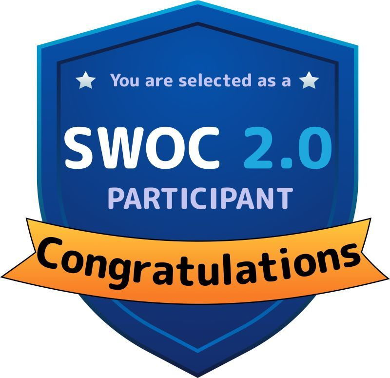
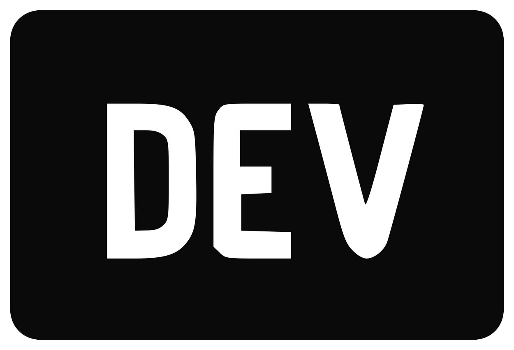

<h1 align="center"> Hey there, I'm Avinash</h1>

<h3 align="center">AI Enthusiast, Open-source Contributor and Life-Long Learner</h3>

 
<b> "Sleep😴 To Program Your Subconscious Space"</b>

  
- Computer Science & Engineering - 3rd year @ Mepco Schlenk Engineering College. 🎓
- Currently working with <a href="https://ezovion.com/" target="_black">Ezovion</a> as an Intern. 🏥
- Looking for opportunities and collaborations in the field of data science. ✅
- Seeking opportunities to work in a challenging environments and push my boundaries. 💪
- Planning to Blog in the near future. 📝

Portfolio :<a href="https://avinash-218.github.io/avinash-portfolio-2/" target="_blank"> https://avinash-218.github.io/avinash-portfolio/</a>

<h3 align="left">Interests:</h3>

- Data Science 📊
- Data Structures And Algorithms 💻
- Database 

<h3 align="left">Languages:</h3>

- English 🔤
- Tamil

**Tech Toolbox🧰** 

  

<a href="https://github.com/" target="_blank"> 

  
**Badges🥇** 

  
# Achievements :
  - 58th Rank in Hexaware Data Science Engineer Challenge - TechGig
  - Eligible for Seed-Funding from Mepco Schlenk Engineering College
  - Got selected to meet-up with Angel Investors.

  
## &#x1f4c8; My GitHub Stats🎯
 
<h3 align="left">Profile Views: 🧐</h3>
  

  

Contribution Graph

  

Trophies

  

   
  

  

<a href="https://gitstalk.netlify.app/avinash-218/" target="_blank"> See My Latest Activities Here</a>
 
<h3 align="left">Connect with me:</h3>

<a href="https://github.com/" target="_blank"> 

  

